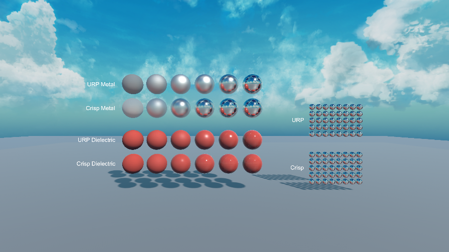
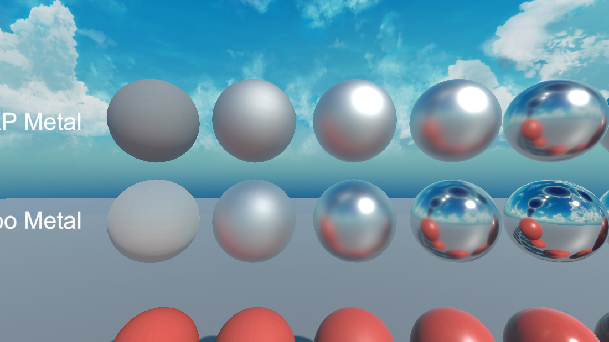
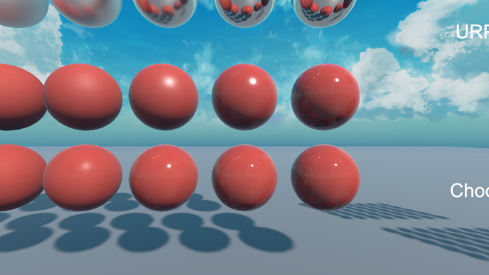

# Crisp Lit

A replacement for URP's `Lit` shader that uses a full-quality BRDF instead of URP's
mobile-optimised approximations — while consuming URP's own lighting API, pass structure
and keyword set, so shadows, Forward+, decals, SSAO, lightmaps and probe volumes keep
working exactly as before.



*Same scene, same lighting, same material parameters. Rows 1–2: metal, rows 3–4: dielectric,
smoothness increasing left to right. Rows 2 and 4 are Crisp.*

## Why this exists

URP's `Lit` shader was designed to run on phones, and its BRDF reflects that. The
approximations are sensible for that target and unnecessary on anything with a discrete GPU:

- The visibility term is Kelemen's `1 / (LoH² · (roughness + 0.5))` approximation, and the
  Fresnel term is folded into it rather than evaluated. Metals therefore lose their
  characteristic edge tint, and highlights are the wrong shape at grazing angles.
- There is no multiscatter compensation, so rough metals lose energy and darken. This is the
  single most visible difference — the leftmost spheres in the screenshot above.
- Indirect specular uses an empirical `surfaceReduction · lerp(specular, grazingTerm, fresnel)`
  fit rather than a split-sum environment BRDF.
- Ambient occlusion multiplies the diffuse term only, so occluded cavities still receive full
  specular and never look properly recessed.
- There is no specular anti-aliasing, so curved and distant normal-mapped surfaces sparkle.

This is most of the reason a default URP scene reads flatter than the equivalent HDRP scene.
Crisp replaces exactly those terms and nothing else.

## What is different

| Term | URP Lit | Crisp Lit |
| --- | --- | --- |
| Normal distribution | GGX | GGX |
| Visibility | Kelemen approximation | Height-correlated Smith |
| Fresnel | folded into the visibility approximation | Schlick, coloured F0 |
| Multiscattering | none | energy compensation (Fdez-Agüera) |
| Diffuse | Lambert | Disney (Burley) |
| Indirect specular | empirical fit | split-sum with a preintegrated DFG LUT |
| Occlusion | diffuse only | specular occlusion + horizon occlusion |
| Micro-shadowing | none | AO-derived (Chan) |
| Specular AA | none | normal-variance filtering (Tokuyoshi & Kaplanyan) |
| Texture fetches for metallic/AO/smoothness | 2 (metallic-smoothness + occlusion) | 1 (packed mask map) |

### Metals



The rough metals on the left are the clearest case: URP's loses energy and settles into flat
grey, Crisp's stays bright and picks up the sky. Toward the middle the highlight is tighter and
warmer, and the environment reflection is more saturated rather than washed toward grey.

### Dielectrics



Subtler, as it should be. The Crisp row (bottom) has a smaller, brighter specular core from the
correct Fresnel term, a fuller falloff toward the terminator from Disney diffuse, and picks up
noticeably more sky at grazing angles.

## Performance

Measured on a Radeon RX 9070 XT, D3D12, in a deliberately fragment-bound test: one full-screen
quad into a 4096×4096 RGBAHalf render target (16.8M fragments), asynchronous shader compilation
disabled, 15 warm-up renders followed by 40 timed renders, median of three interleaved rounds.

| Scenario | URP Lit | Crisp Lit | Ratio |
| --- | --- | --- | --- |
| One directional light, no shadows | 4.86 ms | 4.99 ms | 1.03× |
| Plus 8 point lights (Forward+) | 6.20 ms | 6.54 ms | 1.06× |

Compiled fragment size for the `ForwardLit` pass (DXBC, D3D):

| Variant | URP Lit | Crisp Lit | Ratio |
| --- | --- | --- | --- |
| Bare | 3190 B | 5362 B | 1.68× |
| Normal map + mask map | 4018 B | 6426 B | 1.60× |
| Plus main light shadows | 10486 B | 12866 B | 1.23× |
| Plus Forward+ additional lights | 29586 B | 33878 B | 1.15× |

The extra arithmetic is roughly a hundred instructions per pixel plus a few per light. It looks
significant against a bare variant and disappears into the noise once shadow sampling, GI and
the light loop are present — which is every real material. The packed mask map also removes one
texture fetch relative to URP, which offsets part of the ALU cost.

These are synthetic numbers from one GPU and one scene. Measure your own content before
drawing conclusions about your frame budget.

## Installation

Unity 6.3 (6000.3) or newer with URP 17.3. In the Package Manager, choose *Install package from
git URL* and enter:

```
https://github.com/OxygenButBeta/CrispLit.git
```

Or add it to `Packages/manifest.json`:

```json
"com.crisp.lit": "https://github.com/OxygenButBeta/CrispLit.git"
```

## Usage

Assign `Crisp/Lit` (or `Crisp/Unlit`) to a material. The inspector groups properties the same way
URP's does, and keywords are handled for you: assigning a mask map or a normal map enables the
corresponding keyword, and changing the surface type rewrites the blend state and render queue.

### Mask map

Crisp reads one packed texture instead of URP's separate metallic-smoothness and occlusion maps.
The channel layout matches HDRP's, so existing HDRP mask maps work unchanged:

| Channel | Content |
| --- | --- |
| R | Metallic |
| G | Ambient occlusion |
| B | Unused (reserved for detail masking) |
| A | Smoothness |

The `Metallic` and `Smoothness` sliders multiply the mask, so leaving both at 1 uses the texture
as authored. `AO Strength` only appears when a mask map is assigned, because that is where the
occlusion data comes from.

### Converting existing materials

Two entries under `Tools/Crisp`:

- **Convert Selected Materials** — converts the URP Lit materials selected in the Project window.
- **Convert Scene Materials** — scans the open scene's renderers, lists the URP Lit materials it
  found, and converts them after confirmation.

Both operate on the material assets themselves, so every user of a converted material is
affected, not just the scene you ran it from. Matching properties carry over automatically, and
if the source material has a metallic-smoothness or occlusion map, the converter packs them into
a MADS texture written next to the material as `<name>_MaskMap.png`. Materials using the
specular workflow are skipped with a message; detail maps are dropped with a warning.

### DFG LUT

The split-sum environment BRDF is read from a preintegrated 128×128 lookup table shipped with the
package and bound globally at load. If it is ever missing the shader falls back to Karis'
analytic approximation, so specular can never collapse to black in a build. `Tools/Crisp/Generate
DFG LUT` regenerates it; you only need this if you have the package embedded and want to change
the integration parameters.

## Scope and limitations

Deliberately not implemented, because the point was a better base material rather than a superset:

- **Always lit forward, whatever the renderer.** A deferred renderer would shade a GBuffer with
  URP's BRDF, which is the thing this package exists to replace, so Crisp never takes that path.
  See *Deferred renderers* below for what that costs.
- **Metallic workflow only.** No specular workflow.
- No detail maps, no parallax, no clear coat, no anisotropy, no transmission or sheen.
- Not tested on mobile or WebGL. The BRDF is aimed at hardware where the extra arithmetic is free;
  on a phone, URP's own Lit is the better choice.
- Verified on D3D12 and D3D11 only. Nothing in the shader is backend-specific, but Vulkan, Metal
  and consoles are untested.

## How it stays compatible

The lighting model is the only part that is ours. Everything that connects a shader to the
pipeline is taken from URP directly:

- Lights, shadows, GI, fog, decals and screen-space occlusion come from URP's shader library
  functions (`GetMainLight`, the Forward+ cluster loop macros, `SAMPLE_GI`, `MixFog`,
  `ApplyDecalToSurfaceData`), so renderer features work without special handling.
- The `multi_compile` block in `CrispLit.shader` is copied verbatim from URP's `Lit.shader` for
  the target version. This is the actual compatibility surface: if a renderer feature toggles a
  keyword the shader does not compile a variant for, the feature silently does nothing.
- Pass names, `LightMode` tags and the `UniversalMaterialType` tag match URP's — specifically
  those of `ComplexLit`, the shader URP itself ships for materials its deferred path cannot light.
- The shadow caster, depth, depth-normals, GBuffer and meta passes are URP's own pass files,
  included rather than forked. That is why `CrispLitInput.hlsl` exposes
  `InitializeStandardLitSurfaceData` under exactly that name — it is the contract those files
  expect.

Upgrading to a new URP version means diffing the keyword block against the new `Lit.shader` and
recompiling. Releases are tagged against the URP version they were verified with.

## Deferred renderers

Crisp works under a deferred renderer, but not by being deferred. Three tags carry that:

| Pass | Tag | Why |
| --- | --- | --- |
| `ForwardLit` | `UniversalForwardOnly` | A deferred renderer draws opaques through `UniversalGBuffer` and `UniversalForwardOnly` only. A `UniversalForward` pass is never reached there — the material would not draw at all, not fall back. |
| `DepthNormalsOnly` | `DepthNormalsOnly` | The forward prepass accepts `DepthNormals` and `DepthNormalsOnly`; the deferred prepass accepts only the latter. Without it, SSAO, decals and normal-reading renderer features see nothing. |
| `GBuffer` | `UniversalGBuffer` | Fills the GBuffer so anything that re-reads it sees the surface rather than a hole — URP's rendering debugger, and screen-space GI/AO packages that draw their own `UniversalGBuffer` renderer list to reconstruct albedo. Never lights the surface. |

The cost under a deferred renderer is that opaque Crisp geometry is drawn twice: once into the
GBuffer, then again in the forward-only pass, which overdraws whatever URP's deferred lighting
produced for those pixels. Under Forward+ the GBuffer pass is not scheduled by URP at all and
costs nothing unless a renderer feature asks for it. `ComplexLit` makes the same trade for the
same reason.

## Planned

- A sample scene with the comparison rig, built from primitives so it can ship with the package.
- Verification on Vulkan and Metal.
- Optional clear coat, for painted and lacquered surfaces.

## References

The techniques are standard; the papers are worth reading if you want to change them.

- Heitz, *Understanding the Masking-Shadowing Function in Microfacet-Based BRDFs* (2014) — height-correlated Smith.
- Fdez-Agüera, *A Multiple-Scattering Microfacet Model for Real-Time Image-Based Lighting* (2019) — energy compensation.
- Karis, *Real Shading in Unreal Engine 4* (2013) — split-sum, analytic DFG fallback.
- Burley, *Physically Based Shading at Disney* (2012) — diffuse term.
- Lagarde & de Rousiers, *Moving Frostbite to PBR* (2014) — specular occlusion.
- Chan, *Material Advances in Call of Duty: WWII* (2018) — micro-shadowing.
- Tokuyoshi & Kaplanyan, *Improved Geometric Specular Antialiasing* (2019).

## License

MIT. See [LICENSE](LICENSE).
